# Project Title

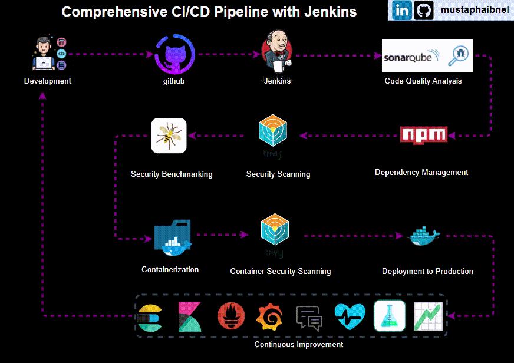

Brief description of your project: A fully implemented simple calculator API that exemplifies best practices and a full workflow in a CI/CD pipeline.

## Jenkins CI/CD Pipeline Stages

This section describes each stage of the Jenkins CI/CD pipeline for the project, showcasing the various stages from code checkout to deployment, ensuring code quality, security, and seamless integration and delivery.

### Prepare Environment
This stage prepares the environment for the build.
<table>
  <tr>
    <td>
      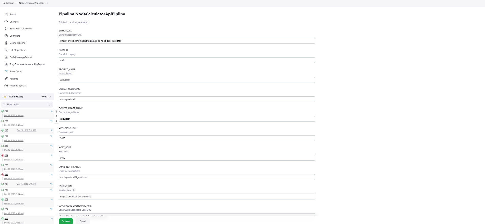
      
Prepare Environment Step 1

    </td>
    <td>
      
      
Prepare Environment Step 2

    </td>
  </tr>
</table>

### Checkout Code
This stage checks out the code from the GitHub repository.
<table>
  <tr>
    <td>
      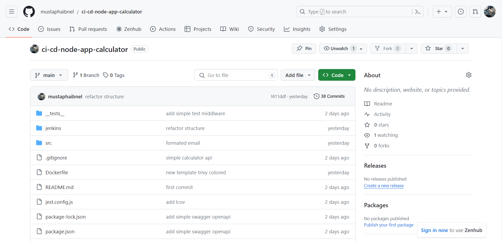
      
Checkout Code

    </td>
    <td>
      <!-- Placeholder for second image if needed -->
    </td>
  </tr>
</table>

### Install Dependencies
This stage installs the necessary dependencies for the project.
<table>
  <tr>
    <td>
      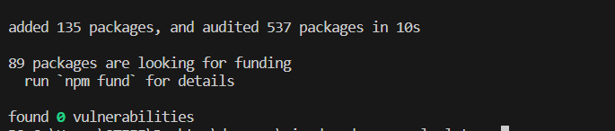
      
Install Dependencies

    </td>
    <td>
      <!-- Placeholder for second image if needed -->
    </td>
  </tr>
</table>

### Run Tests and Coverage
This stage runs tests and generates coverage reports.
<table>
  <tr>
    <td>
      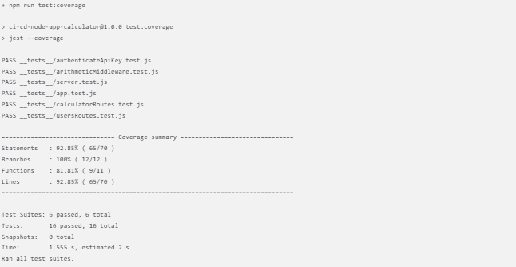
      
Run Tests

    </td>
    <td>
      <!-- Placeholder for second image if needed -->
    </td>
  </tr>
</table>

### Generate HTML Coverage Report
This stage generates an HTML coverage report.
<table>
  <tr>
    <td>
      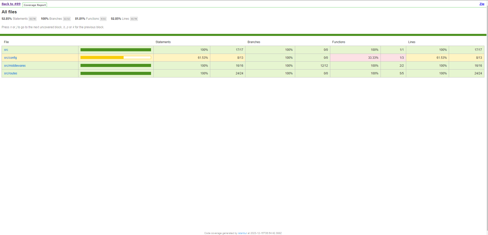
      
Generate HTML Coverage Report Step 1

    </td>
    <td>
      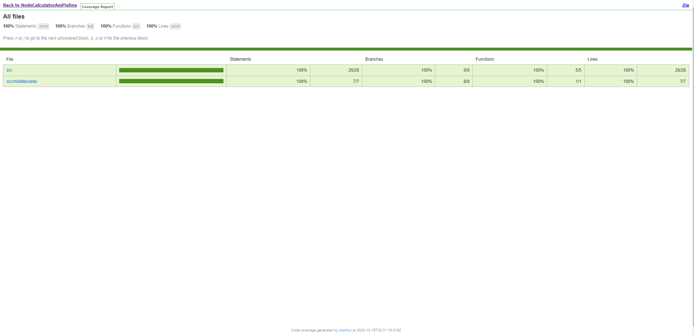
      
Generate HTML Coverage Report Step 2

    </td>
  </tr>
</table>

### Publish Coverage Report
This stage publishes the coverage report.
<table>
  <tr>
    <td>
      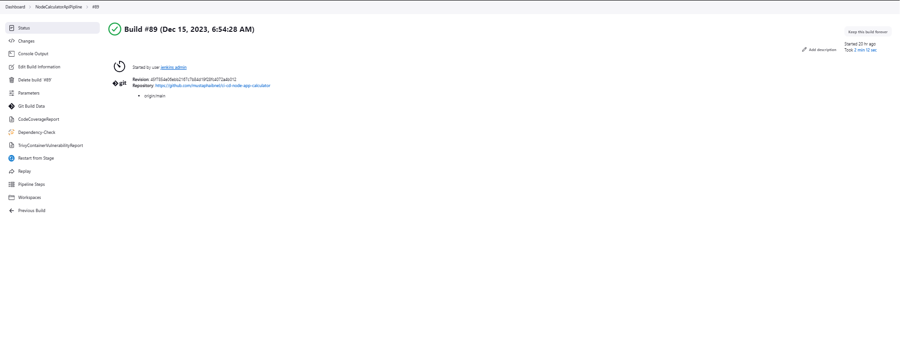
      
Publish Coverage Report

    </td>
    <td>
      <!-- Placeholder for second image if needed -->
    </td>
  </tr>
</table>

### Code Quality Analysis (SonarQube)
This stage analyzes the code quality using SonarQube.
<table>
  <tr>
    <td>
      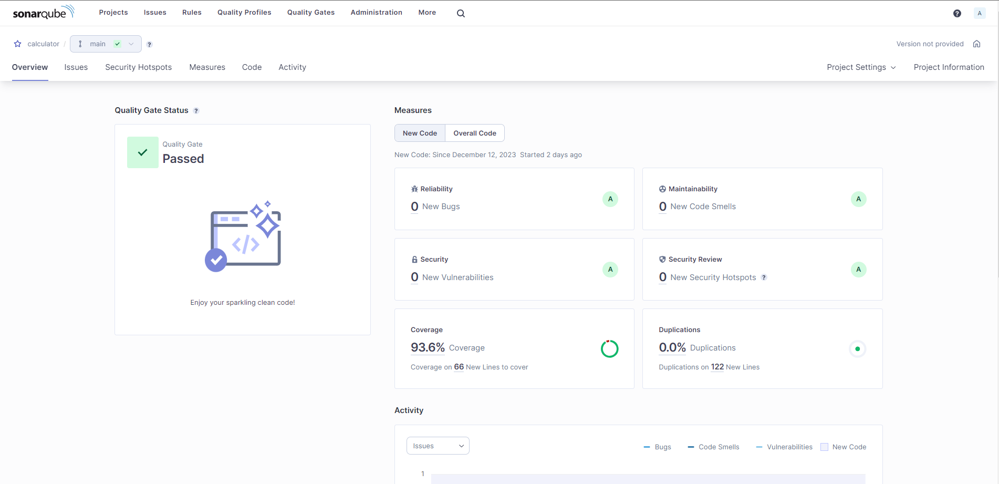
      
Code Quality Analysis Step 1

    </td>
    <td>
      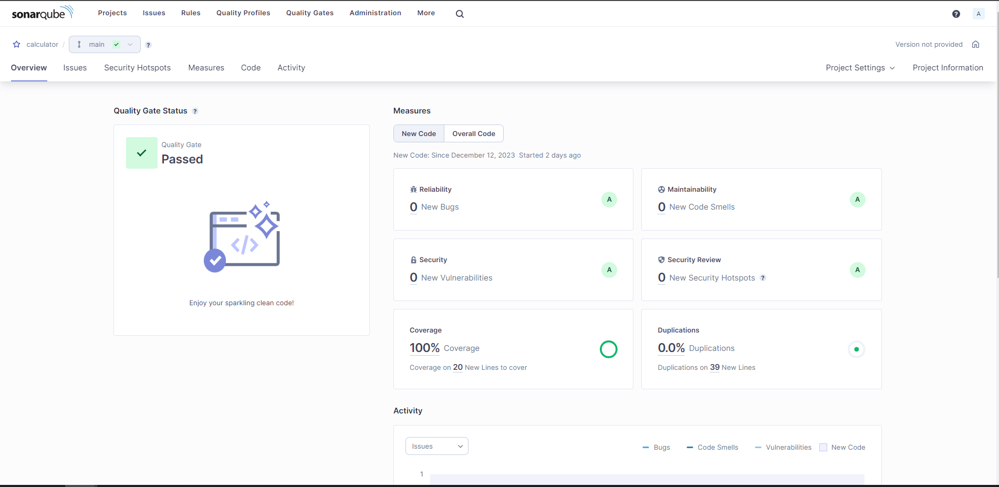
      
Code Quality Analysis Step 2

    </td>
  </tr>
</table>

### Quality Analysis Gate (SonarQube)
This stage waits for the quality gate result from SonarQube.
<table>
  <tr>
    <td>
      
      
Quality Gate Step 1

    </td>
    <td>
      
      
Quality Gate Step 2

    </td>
  </tr>
</table>

### Security Files Scanning (Trivy)
This stage scans security files using Trivy.
<table>
  <tr>
    <td>
      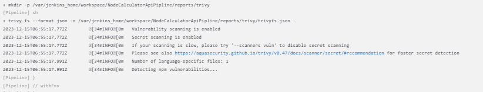
      
Trivy File Scan

    </td>
    <td>
      
      
Trivy File Scan

    </td>
  </tr>
</table>

### Security Benchmarking (OWASP)
This stage performs security benchmarking using OWASP.
<table>
  <tr>
    <td>
      
      
OWASP Benchmark Step 1

    </td>
    <td>
      
      
OWASP Benchmark Step 2

    </td>
  </tr>
</table>

### Containerization (Docker)
This stage involves containerizing the application using Docker.
<table>
  <tr>
    <td>
      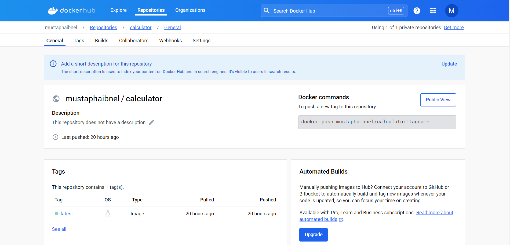
      
Containerization Step 1

    </td>
    <td>
      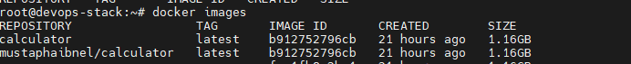
      
Containerization Step 2

    </td>
  </tr>
</table>

### Container Security Scanning (Trivy)
This stage scans the Docker container for vulnerabilities using Trivy.
<table>
  <tr>
    <td>
      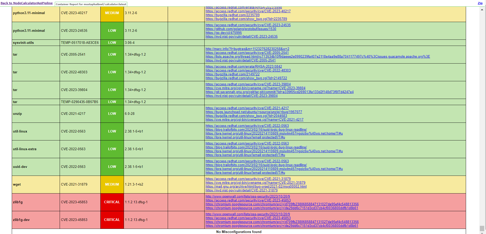
      
Trivy Container Scan Step 1

    </td>
    <td>
      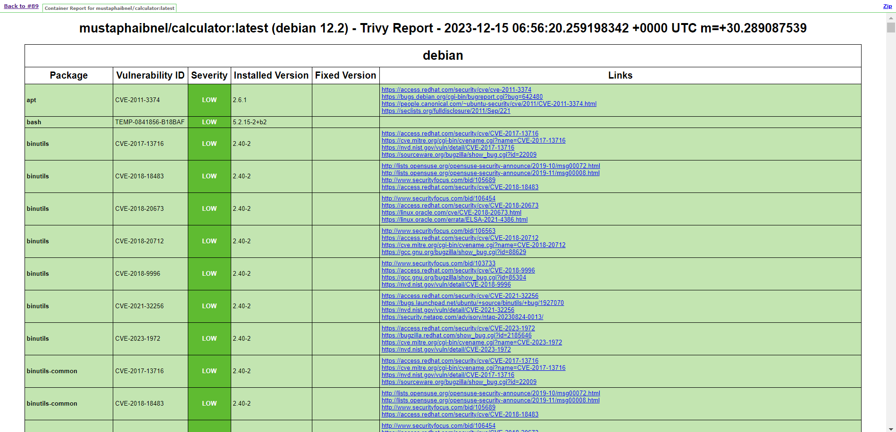
      
Trivy Container Scan Step 2

    </td>
  </tr>
</table>

### Deployment
This stage handles the deployment of the application.
<table>
  <tr>
    <td>
      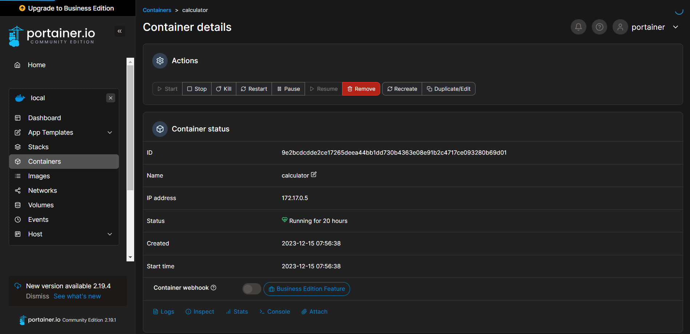
      
Deployment Step 1

    </td>
    <td>
      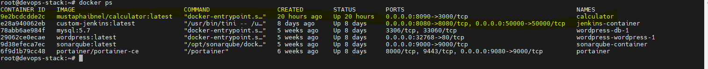
      
Deployment Step 2

    </td>
  </tr>
</table>

## Post-Deployment Activities

### Email Notifications
The pipeline is configured to send email notifications upon completion of the build process, providing information on the build status, including success or failure notifications.
<table>
  <tr>
    <td>
      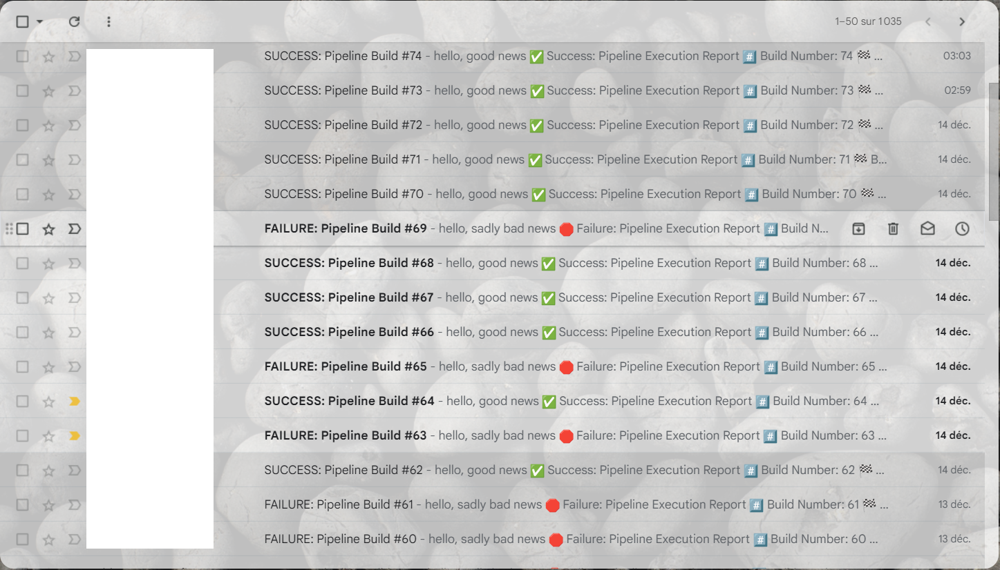
      
Email Notification Example

    </td>
    <!-- Add more images if necessary -->
  </tr>
</table>

### Swagger Documentation
The API is documented with Swagger, offering an interactive interface for exploring the API endpoints and their responses.
<table>
  <tr>
    <td>
      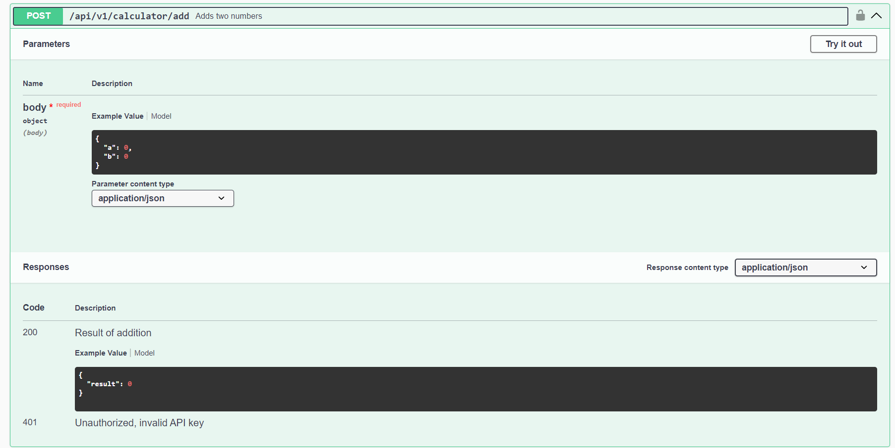
      
Swagger API Documentation

    </td>
    <!-- Add more images if necessary -->
  </tr>
</table>

### Postman Testing
A Postman collection is available for testing the API endpoints. This collection can be used to understand and validate the request/response flow of the API.
<table>
  <tr>
    <td>
      
      
Postman API Testing

    </td>
    <!-- Add more images if necessary -->
  </tr>
</table>

### Docker Container Monitoring
Docker containers are monitored to ensure they are running as expected. This includes monitoring resource usage, uptime, and health status.
<table>
  <tr>
    <td>
      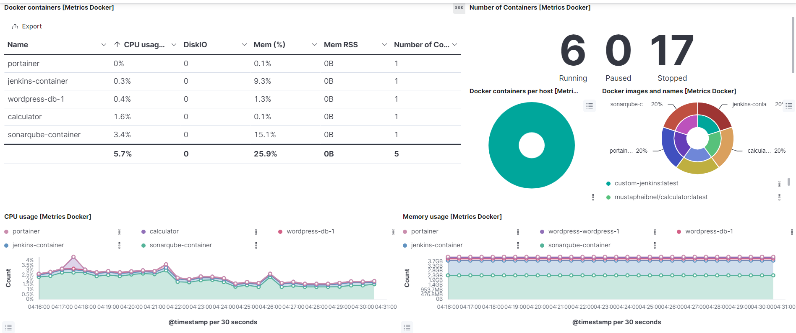
      
Docker Container Monitoring(Elastic Stack)

    </td>
    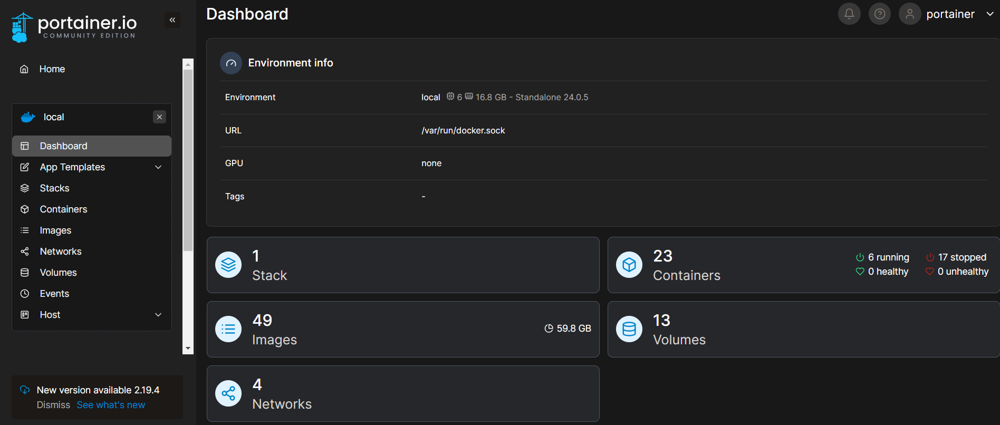
      
Docker Container Monitoring(Portainer)

  </tr>
</table>

### Application Performance Monitoring
The application is monitored using tools like Elastic APM, providing insights into performance metrics, error rates, and response times. This helps in understanding the application behavior under various conditions.
<table>
  <tr>
    <td>
      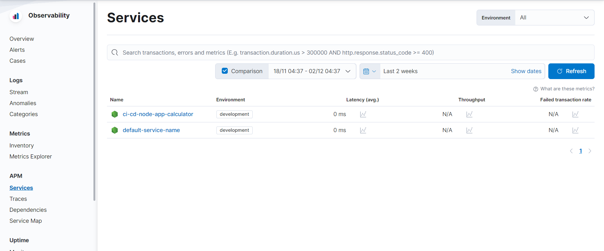
      
Application Performance Monitoring

    </td>
    <!-- Add more images if necessary -->
  </tr>
</table>

## Environment Variables and Parameters

[Include the section as previously provided]

## GitHub Actions Integration

[Include the section as previously provided]

## How to Use the Calculator API

Provide detailed instructions on how to interact with the calculator API, including example requests and responses for each endpoint.

## Post-Deployment Activities

[Include sections on Email Notifications, Manual Testing, Stress Testing and API Testing, Monitoring with Elastic APM]

## Stack Implementation Details

[Include details on the technology stack]
