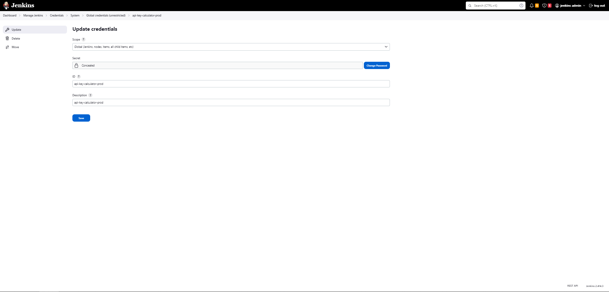

Welcome to the repository of our CI/CD Node.js Calculator Application, a model of modern software engineering practices with a robust calculator API. This project is a showcase of best practices in continuous integration and continuous deployment (CI/CD) tailored for Node.js applications.

## Project Highlights

- **Robust Calculator API**: Provides basic arithmetic operations, designed for efficiency and reliability.
- **Advanced CI/CD Pipeline**: Features a fully integrated Jenkins pipeline, covering all stages from code checkout to deployment.
- **Quality and Security Assurance**: Integrates code quality checks, security scanning (SonarQube, Trivy, OWASP), and automated testing, ensuring top-notch code integrity.
- **Stress Testing & Scalability**: Implements API stress testing to manage scaling up and down efficiently, guaranteeing performance under load.
- **Comprehensive Monitoring**: Utilizes the ELK stack for thorough monitoring of the application stack and performance, ensuring high availability and real-time insights.
- **Extensive Documentation**: Includes detailed Swagger documentation for a clear understanding of API functionalities.
- **Containerization with Docker**: Demonstrates practical use of Docker for simplified deployment and scalability.

## Getting Started

Clone the repository to get started and follow our [setup guide](#setup-guide) for detailed instructions on installation, environment setup, and running the application.

# Table of Contents

1. [Project Overview](#project-overview)
2. [Jenkins CI/CD Pipeline Stages](#jenkins-cicd-pipeline-stages)
   - [Prepare Environment](#prepare-environment)
   - [Checkout Code](#checkout-code)
   - [Install Dependencies](#install-dependencies)
   - [Run Tests and Coverage](#run-tests-and-coverage)
   - [Generate HTML Coverage Report](#generate-html-coverage-report)
   - [Publish Coverage Report](#publish-coverage-report)
   - [Code Quality Analysis (SonarQube)](#code-quality-analysis-sonarqube)
   - [Quality Analysis Gate (SonarQube)](#quality-analysis-gate-sonarqube)
   - [Security Files Scanning (Trivy)](#security-files-scanning-trivy)
   - [Security Benchmarking (OWASP)](#security-benchmarking-owasp)
   - [Containerization (Docker)](#containerization-docker)
   - [Container Security Scanning (Trivy)](#container-security-scanning-trivy)
   - [Deployment](#deployment)
3. [Post-Deployment Activities](#post-deployment-activities)
   - [Email Notifications](#email-notifications)
   - [Swagger Documentation](#swagger-documentation)
   - [Postman Testing](#postman-testing)
   - [Docker Container Monitoring](#docker-container-monitoring)
   - [Application Performance Monitoring](#application-performance-monitoring)
4. [Environment Variables and Parameters](#environment-variables-and-parameters)
   - [Required Environment Variables](#required-environment-variables)
   - [Adjusting Pipeline Parameters](#adjusting-pipeline-parameters)
   - [Elastic APM Configuration](#elastic-apm-configuration)
5. [GitHub Actions Integration](#github-actions-integration)

# Project Overview
<table>
  <tr>
    <td>
      
      
overview API CI CD

    </td>
    <td>
      
      
overview API CI CD

    </td>
    <!-- Add more images if necessary -->
  </tr>
</table>

## Jenkins CI/CD Pipeline Stages

This section describes each stage of the Jenkins CI/CD pipeline for the project, showcasing the various stages from code checkout to deployment, ensuring code quality, security, and seamless integration and delivery.

### Prepare Environment
This stage prepares the environment for the build.
<table>
  <tr>
    <td>
      
      
Prepare Environment Step 1

    </td>
    <td>
      
      
Prepare Environment Step 2

    </td>
  </tr>
</table>

### Checkout Code
This stage checks out the code from the GitHub repository.
<table>
  <tr>
    <td>
      
      
Checkout Code

    </td>
    <td>
    
      
Checkout Code

    </td>
  </tr>
</table>

### Install Dependencies
This stage installs the necessary dependencies for the project.
<table>
  <tr>
    <td>
      
      
Install Dependencies

    </td>
    <td>
      <!-- Placeholder for second image if needed -->
    </td>
  </tr>
</table>

### Run Tests and Coverage
This stage runs tests and generates coverage reports.
<table>
  <tr>
    <td>
      
      
Run Tests

    </td>
    <td>
    </td>
  </tr>
</table>

### Generate HTML Coverage Report
This stage generates an HTML coverage report.
<table>
  <tr>
    <td>
      
      
Generate HTML Coverage Report Step 1

    </td>
    <td>
      
      
Generate HTML Coverage Report Step 2

    </td>
  </tr>
</table>

### Publish Coverage Report
This stage publishes the coverage report.
<table>
  <tr>
    <td>
      
      
Publish Coverage Report

    </td>
    <td>
      <!-- Placeholder for second image if needed -->
    </td>
  </tr>
</table>

### Code Quality Analysis (SonarQube)
This stage analyzes the code quality using SonarQube.
<table>
  <tr>
    <td>
      
      
Code Quality Analysis Step 1

    </td>
    <td>
      
      
Code Quality Analysis Step 2

    </td>
  </tr>
</table>

### Quality Analysis Gate (SonarQube)
This stage waits for the quality gate result from SonarQube.

### Security Files Scanning (Trivy)
This stage scans security files using Trivy.
<table>
  <tr>
    <td>
      
      
Trivy File Scan

    </td>
    <td>
    </td>
  </tr>
</table>

### Security Benchmarking (OWASP)
This stage performs security benchmarking using OWASP.
<table>
  <tr>
    <td>
      
      
OWASP Benchmark Step 1

    </td>
    <td>
    </td>
  </tr>
</table>

### Containerization (Docker)
This stage involves containerizing the application using Docker.
<table>
  <tr>
    <td>
      
      
Containerization Step 1

    </td>
    <td>
      
      
Containerization Step 2

    </td>
  </tr>
</table>

### Container Security Scanning (Trivy)
This stage scans the Docker container for vulnerabilities using Trivy.
<table>
  <tr>
    <td>
      
      
Trivy Container Scan Step 1

    </td>
    <td>
      
      
Trivy Container Scan Step 2

    </td>
  </tr>
</table>

### Deployment
This stage handles the deployment of the application.
<table>
  <tr>
    <td>
      
      
Deployment Step 1

    </td>
    <td>
      
      
Deployment Step 2

    </td>
  </tr>
</table>

## Post-Deployment Activities

### Email Notifications
The pipeline is configured to send email notifications upon completion of the build process, providing information on the build status, including success or failure notifications.
<table>
  <tr>
    <td>
      
      
Email Notification Example

    </td>
    <td>
      
      
Email Notification Example

    </td>
  </tr>
</table>

### Swagger Documentation
The API is documented with Swagger, offering an interactive interface for exploring the API endpoints and their responses.
<table>
  <tr>
    <td>
      
      
Swagger API Documentation

    </td>
    <td>
      
      
Swagger API Documentation

    </td>
    <!-- Add more images if necessary -->
  </tr>
</table>

### Postman Testing
A Postman collection is available for testing the API endpoints. This collection can be used to understand and validate the request/response flow of the API.
<table>
  <tr>
    <td>
      
      
Postman API Testing

    </td>
    <td>
      
      
Postman API Testing

    </td>
  </tr>
</table>

### Docker Container Monitoring

Docker containers are monitored to ensure they are running as expected. This includes monitoring resource usage, uptime, and health status.
<table>
  <tr>
    <td>
      
      
Docker Container Monitoring(Elastic Stack)

    </td>
        <td>
    
      
Docker Container Monitoring(Portainer)

      </td>
  </tr>
</table>

### Application Performance Monitoring

The application is monitored using tools like Elastic APM, providing insights into performance metrics, error rates, and response times. This helps in understanding the application behavior under various conditions.
<table>
  <tr>
    <td>
      
      
Application Performance Monitoring

    </td>
    <!-- Add more images if necessary -->
  </tr>
</table>

## Environment Variables and Parameters

To successfully run this Jenkins pipeline, specific environment variables and parameters need to be defined. These are used throughout the pipeline to customize the build and deployment process.

### Required Environment Variables:

- `SCANNER_HOME`: Specifies the home directory of the Sonar scanner.
- `MOCK_API_KEY` and `EXPECTED_API_KEY`: Used for API authentication during testing.
- Additional environment variables for Elastic APM as discussed earlier, like `APM_SERVICE_NAME`, `APM_SECRET_TOKEN`, and `APM_SERVER_URL`.

### Adjusting Pipeline Parameters:

The pipeline includes several parameters that you may need to adjust according to your environment:
- `GITHUB_URL`: URL of the GitHub repository.
- `BRANCH`: The branch to deploy.
- `PROJECT_NAME`, `DOCKER_USERNAME`, `DOCKER_IMAGE_NAME`: Used in the Dockerization stage.
- `CONTAINER_PORT`, `HOST_PORT`: Port configurations.
- `EMAIL_NOTIFICATION`: For sending build status emails.
- `JENKINS_URL`, `SONARQUBE_DASHBOARD_URL`, `API_END_POINT_URL`: Relevant URLs for the Jenkins server, SonarQube dashboard, and the API endpoint.
### Elastic APM Configuration:
To enable Elastic APM monitoring, set the following environment variables:
- `ELASTIC_APM_ACTIVE`: Set to `true` to activate Elastic APM.
- `APM_SERVICE_NAME`: The name of your service.
- `APM_SECRET_TOKEN`: Secret token for APM Server.
- `APM_SERVER_URL`: URL of the APM Server.
## GitHub Actions Integration
To trigger this Jenkins pipeline through GitHub Actions, you need to set up a GitHub Actions workflow. The workflow should include steps to invoke the Jenkins pipeline whenever code is pushed to the specified branch or when a pull request is made.

## Contributing

Contributions are welcome! Feel free to create issues or submit pull requests if you have suggestions or enhancements.

## License

This project is licensed under the MIT License - see the [LICENSE](LICENSE) file for details.
